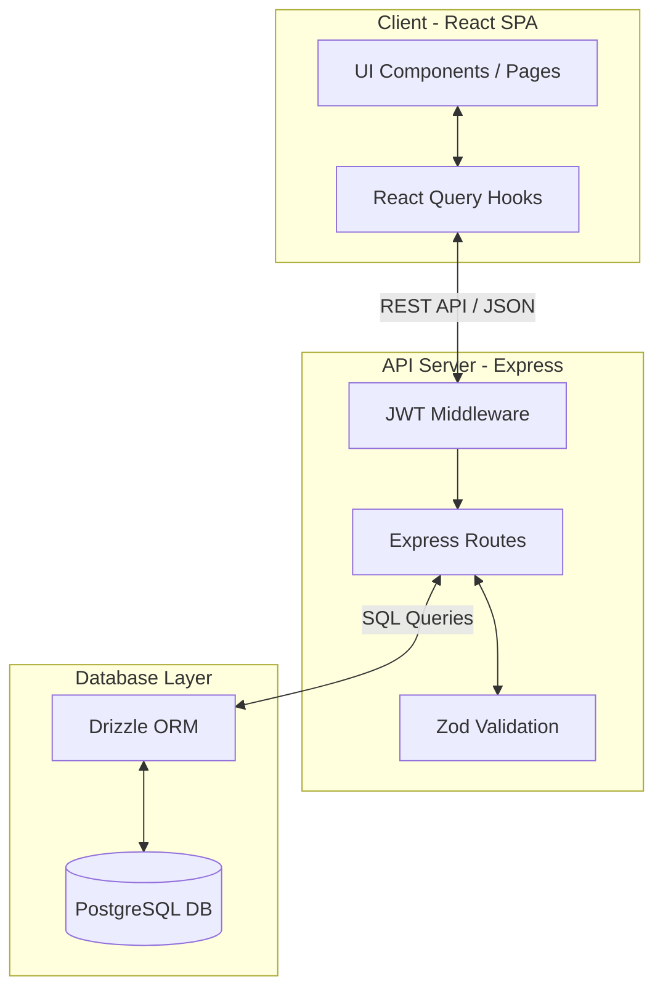

# Traveloop - Project Documentation

## 1. Project Proposal & Overview
**Traveloop** is an enterprise-grade travel planning platform. It allows users to seamlessly plan trips, build day-by-day itineraries, discover cities and activities, track travel budgets, manage packing lists, and share their journeys. 

The goal of this application is to replace fragmented travel tools (spreadsheets, note apps, separate booking trackers) into one unified, highly visual, and modern dashboard.

---

## 2. Technology Stack

### **Frontend**
*   **Framework:** React (built with Vite for fast HMR)
*   **Routing:** `wouter` (lightweight, hook-based routing)
*   **Styling:** Tailwind CSS + `shadcn/ui` components for a modern, glassmorphism aesthetic.
*   **Data Fetching & State:** `@tanstack/react-query` generated via Orval.

### **Backend**
*   **Server:** Node.js with Express 5
*   **Authentication:** JWT (JSON Web Tokens) stored in localStorage.
*   **API Design:** OpenAPI-first approach. All routes are defined in an `openapi.yaml` file, which is used to automatically generate React hooks and Zod validation schemas.

### **Database**
*   **Database:** PostgreSQL
*   **ORM:** Drizzle ORM (type-safe database queries and schema definitions).

---

## 3. Architecture Diagram

Below is the high-level architecture of how the Traveloop application connects:



**Data Flow:**
1. The user interacts with the **Frontend**.
2. **React Query** triggers a fetch request using the auto-generated API hooks.
3. The request hits the **Express API**, passing the JWT token for authentication.
4. The API validates the payload using **Zod**.
5. **Drizzle ORM** translates the request into a SQL query to fetch or modify data in **PostgreSQL**.
6. The data is returned back up the chain to the user interface.

---

## 4. How to Run the Application

The project is structured as a monorepo using `pnpm` workspaces. To run the application smoothly, open separate terminal tabs and run the following commands:

1. **Start the API Backend Server:**
   ```bash
   pnpm --filter @workspace/api-server run dev
   ```
2. **Start the React Frontend:**
   ```bash
   pnpm --filter @workspace/traveloop run dev
   ```
   *(Note: The frontend runs on `http://localhost:5173`)*
3. **View the Database (Drizzle Studio):**
   ```bash
   pnpm --filter @workspace/db run studio
   ```


